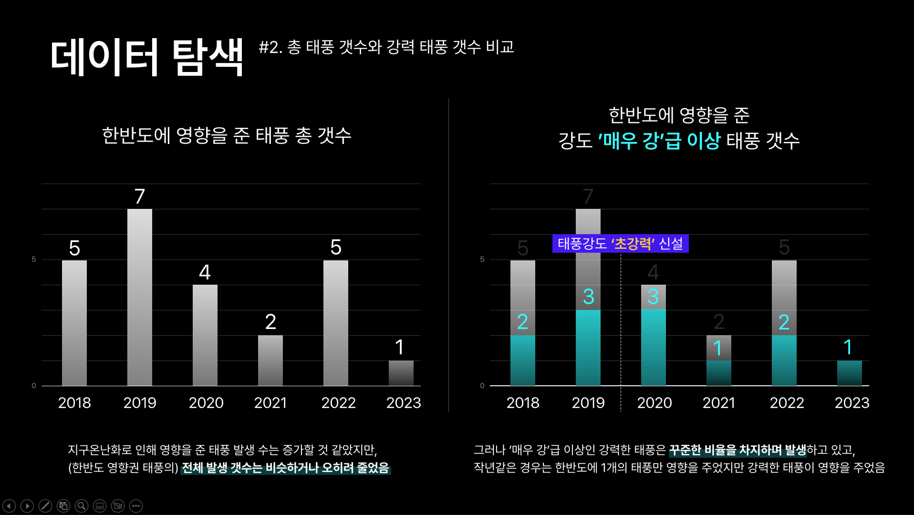
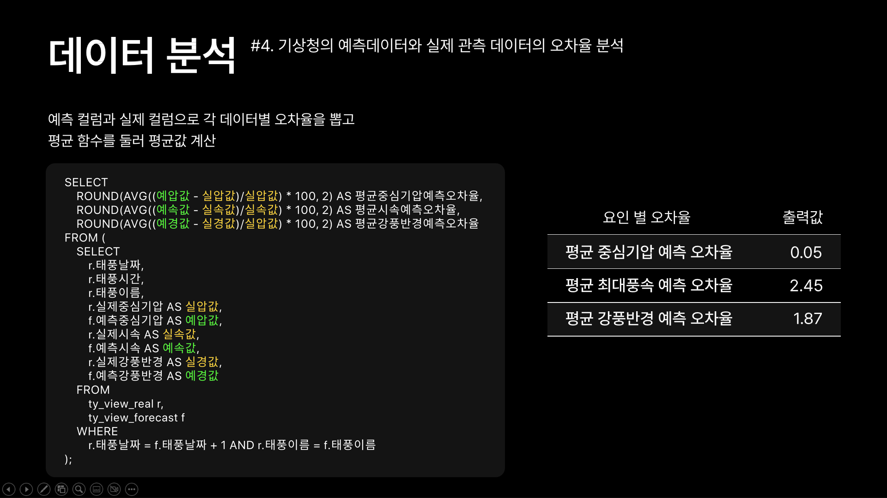

# 🌪️ 한반도에 영향을 준 역대 태풍 분석

### 📅 개발 기간
2024.05.20 ~ 2024.06.05  

### 🌟 프로젝트 소개
- **프로젝트 명:** 한반도에 영향을 준 역대 태풍 분석
- **프로젝트 제작 인원:** 3명

- **주요 역할:** 
  - 기상청 태풍 데이터 전처리  
  - 태풍 데이터 분석 및 시각화 제작
  - 주요 태풍의 발생 원인 및 데이터 시각화   

- **분석 목표:**  
  - 2018~2023년 동안 한반도에 영향을 준 주요 태풍에 대한 데이터 분석   

### 🛠 주요 성과
- 한반도에 피해를 준 태풍의 발생 요인 분석 및 발생 빈도 파악
- 기상청 예측 데이터와의 비교를 통한 분석 결과 도출
---

### 🌟 프로젝트 이미지
- 아래는 프로젝트 발표 자료에서 사용된 대표 슬라이드입니다.
<table align="center">
  <tr>
    <td align="center">
      
      
태풍 분석 메인 슬라이드

    </td>
    <td align="center">
      
      
데이터 탐색

    </td>
    <td align="center">
      
      
데이터 분석

    </td>
  </tr>
</table>

---

### 🔗 프로젝트 문서
- 전체 발표 슬라이드 PDF: [태풍 분석 발표 PDF](./태풍_분석.pdf)

---

### 🛠 주요 기술 및 도구
- **데이터 수집:** 기상청  
- **데이터 분석:** Oracle, Python  
